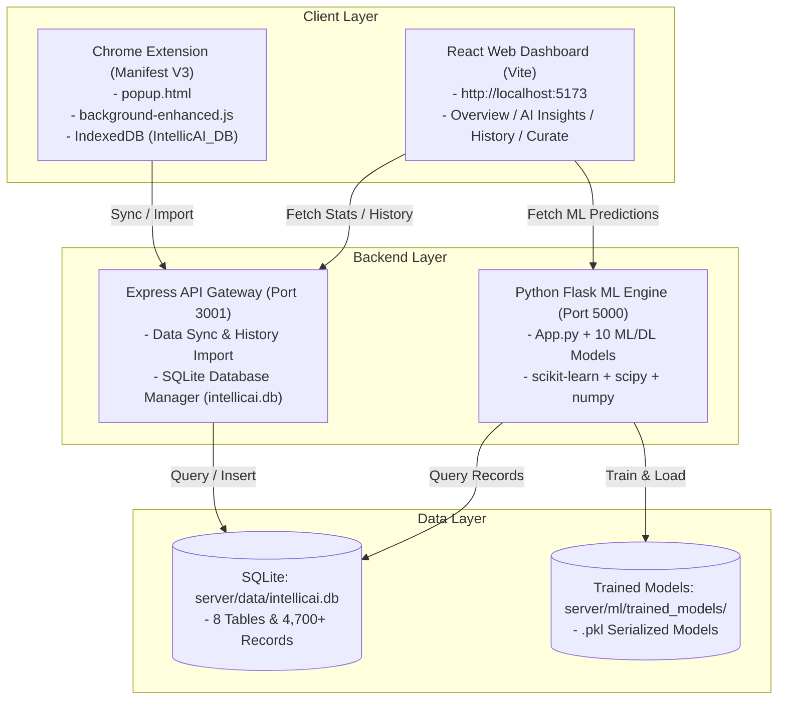

# IntellicAI — Complete Project Analysis & User Guide

**IntellicAI** (formerly SupriAI) is a state-of-the-art **AI-Powered Browsing Intelligence System**. It combines a **Chrome Extension (Manifest V3)**, a **Vite/React Analytics Dashboard**, a **Node.js Express API Gateway**, an **SQLite Database**, and a **Python Flask ML Engine with 10 Machine Learning and Deep Learning algorithms**.

---

## 1. Project Outcome & Purpose

The purpose of IntellicAI is to provide real-time, privacy-aware browsing intelligence that analyzes user browsing habits, predicts productivity, detects behavioral anomalies, generates personalized learning pathways, and automates focus scheduling.

### Key Capabilities
1. **Real-time Browsing Tracking**: Tracks tab activity, domain visit counts, and active time per session.
2. **Offline-First Storage**: Chrome Extension uses **IndexedDB (`IntellicAI_DB`)** when offline and automatically syncs to SQLite (`intellicai.db`) when online.
3. **10 ML & DL Algorithms**: Predicts productivity, clusters browsing habits, detects burnout/distraction anomalies, forecasts weekly time allocation, and recommends learning topics.
4. **Interactive Dashboard**: Modern React UI built with **Lucide React**, **Recharts**, and **Framer Motion** displaying productivity scores, category distribution, history logs, and AI insights.

---

## 2. System Architecture



---

## 3. The 10 Machine Learning & Deep Learning Algorithms

IntellicAI incorporates **6 Traditional ML Algorithms** and **4 Deep Learning/Advanced Models**:

| # | Model / Algorithm | Type | Description / Output |
|---|-------------------|------|----------------------|
| **1** | **Multinomial Naive Bayes + TF-IDF** | Traditional ML | Classifies web domains into `productive`, `social`, `entertainment`, `news`, `shopping`, and `communication`. |
| **2** | **K-Means Clustering** | Traditional ML | Clusters user browsing days into habit profiles (e.g. *Balanced Browser*, *Hyper-Productive*, *Distracted*). |
| **3** | **Random Forest Regressor** | Traditional ML | Predicts daily productivity score (0–100) with feature importance rankings and 95% confidence intervals. |
| **4** | **Isolation Forest** | Traditional ML | Detects distraction spikes, unusual late-night browsing, or tab hovers (anomalies). |
| **5** | **Ridge Regression + Exponential Smoothing** | Traditional ML | Time series forecasting of weekly time usage across categories. |
| **6** | **Decision Tree Classifier** | Traditional ML | Recommends focus modes (`Deep Focus`, `Light Work`, `Break Needed`) and Pomodoro intervals based on session metrics. |
| **7** | **MLP Neural Network (128-64-32)** | Deep Learning | Recommends personalized learning materials, courses, and skill-building resources. |
| **8** | **TF-IDF + LSA (SVD) + MiniBatch K-Means** | Deep Learning | NLP content analysis extracting topic keywords, document clusters, and learning pathways. |
| **9** | **Neural Collaborative Filtering (NCF)** | Deep Learning | Predicts domain engagement based on time-of-day, session length, and historical context. |
| **10** | **Temporal Sequence MLP (RNN-like)** | Deep Learning | Predicts future day browsing metrics and optimal deep-work hours. |

---

## 4. Database Schema (`server/data/intellicai.db`)

The SQLite database contains 8 tables populated with **4,700+ records**:
- `tabs`: Logged tab activities with timestamps, domain, title, category, and active time.
- `sessions`: Browsing sessions with total active time and tab counts.
- `domain_stats`: Aggregated daily stats per domain with visit counts and categories.
- `tab_events`: Granular tab switch, open, and close events.
- `productivity_scores`: Daily productivity scores and category time breakdowns.
- `chrome_history`: Imported Chrome browsing history records.
- `insights`: Serialized outputs and bootstrap findings from ML model runs.
- `goals` & `settings`: User productivity goals and extension configuration.

---

## 5. How to Run the Entire Project

### Prerequisites
- **Node.js** 18+ (tested on Node 24)
- **Python** 3.10+ (dependencies installed: `flask`, `flask-cors`, `scikit-learn`, `scipy`, `numpy`, `joblib`)

### Commands

#### 1. Seed Database & Train ML Models
```bash
cd server
node seed.js
python train_models_with_dummy.py
```

#### 2. Start Full Stack (Vite + Express + Python Flask)
```bash
# In the root directory:
npm run dev
```

This starts:
- **Vite React Frontend**: `http://localhost:5173`
- **Express API Gateway**: `http://localhost:3001`
- **Python Flask ML Engine**: `http://127.0.0.1:5000`

#### 3. Load the Chrome Extension
1. Open Chrome and navigate to `chrome://extensions`.
2. Enable **Developer mode** (top right toggle).
3. Click **Load unpacked**.
4. Select the `public` folder from the `IntellicAI` project directory.
5. Pin the **IntellicAI** extension icon to your toolbar.

---

## 6. Verification Summary

- **Frontend Production Build**: `npm run build` compiled clean (`dist/assets/main-zedXY4sj.js`, `20.30 kB` CSS).
- **Backend Drivers**: Dual support for `sqlite3` and `better-sqlite3` verified on Node 24.
- **REST API Endpoints**: All Express (`:3001`) and Python Flask (`:5000`) endpoints responding with `200 OK`.
- **10/10 ML Models**: Trained, evaluated, and serving real-time predictions.
- **Rebranding**: 100% complete across code, configs, manifests, and documentation.
